# Agile Development with Azure Project: Building a CI/CD Pipeline

### Introduction
For this project, you will integrate an Azure Cloud Shell environment and use it to build, test, deploy and operationalize a Python-based Machine Learning application that uses Flask web framework and sklearn.

## Overview

In this project, you will build a Github repository from scratch and create a scaffolding that will assist you in performing both Continuous Integration and Continuous Delivery. You'll use Github Actions along with a Makefile, requirements.txt, and application code to perform an initial lint, test, and install cycle. Next, you'll integrate this project with Azure Pipelines to enable Continuous Delivery to Azure App Service.

## Project Plan

* Trello board for the project: https://trello.com/b/pjr5W01f/c02-building-a-ci-cd-pipeline
* Spreadsheet that includes the original and final project plan: https://docs.google.com/spreadsheets/d/1KjMFVNLuxH0cEgII7l0ND_510zGJFeAGNsnxxOAQ4tw/edit?usp=sharing

## Architectural Diagram

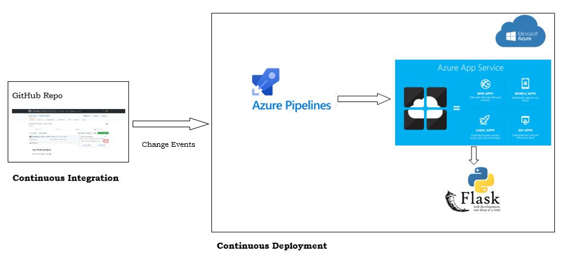

## Instructions

Please see the following instructions for running the Python project.

* First of all create a GitHub repository with the project artifacts and then set up SSH Keys from your Azure Cloud Shell to authenticate connection between your GitHub and Azure Cloud.

* Once done; clone the project there as shown in the screenshot mentioned below.

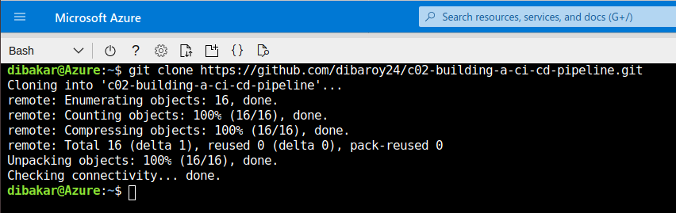

* Create a virtual environment for your application.

* Now run the `make all` command which will execute all the steps mentioned inside the `Makefile` and all the test cases will run. The screenshot below displays the passed tests after running the `make all` command.

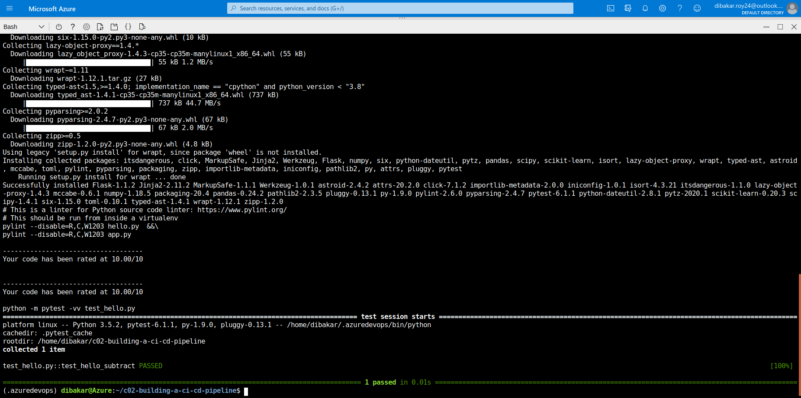

* Next set up Github Actions in your repo by adding the YAML file present in the .github/workflows folder. The screenshot below shows the successful build from GitHub Actions.

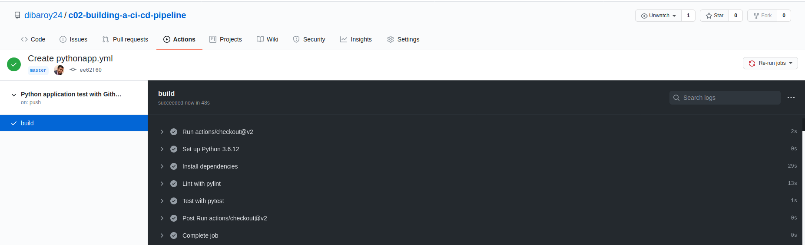

* Go to Azure DevOps page; create a new project, set up a new service connection via Azure Resource Manager and Pipeline, integrate your GitHub repo and configure Python to Linux Web App on Azure which will create the required `azure-pipelines.yml` file in your GitHub repo.

* Once the Azure pipelines and GitHub actions are successfully configured; check that if you make any commit then the pipeline is triggered and it runs successfully.

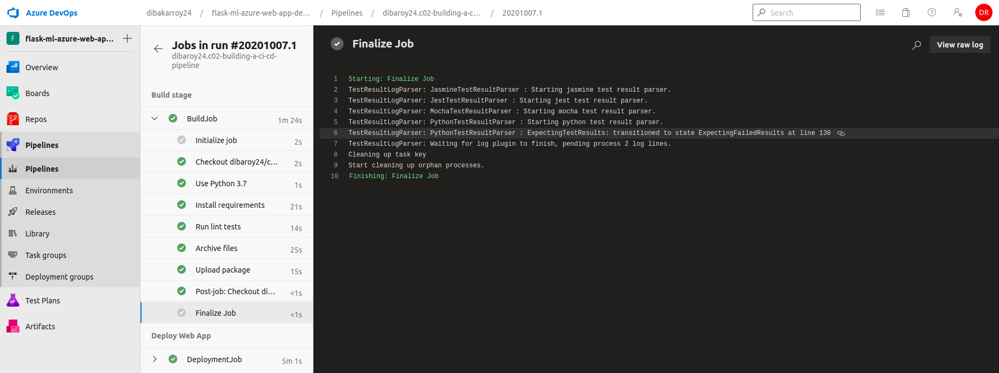

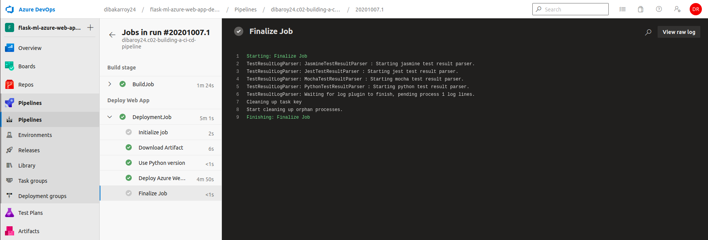

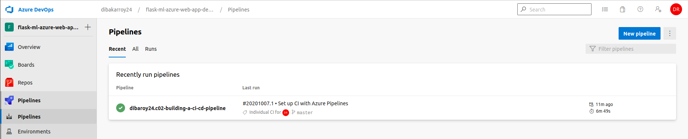

* Next create and deploy the flask-sklearn app to Azure App Service using the `az webapp up -n <name of webapp>` command. Once the Azure Webapp Service is up and running; you will be able to see the flask app on the browser and the output of streamed log files from deployed application as follows.

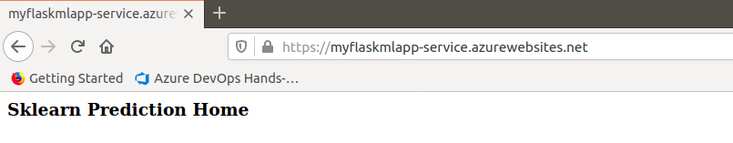

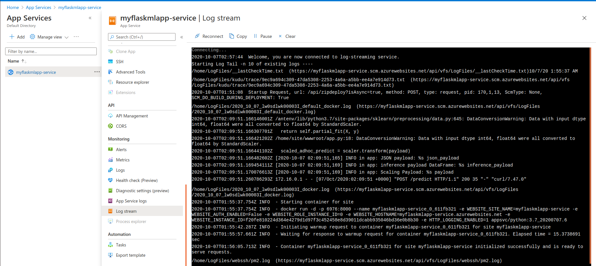

* When the app is successfully deployed then update the app service endpoint in the code and then run script `./make_predict_azure_app` file to make a prediction. The screenshot below shows the successful prediction made from deployed flask app in Azure Cloud Shell.

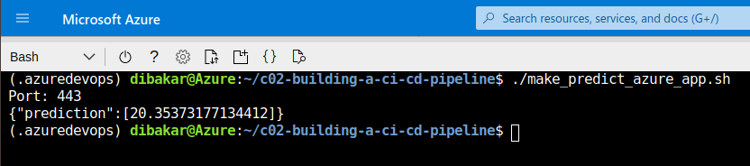

* Lastly, run the `locust` command in your project to perform a load test on the API. You can see an output like this.

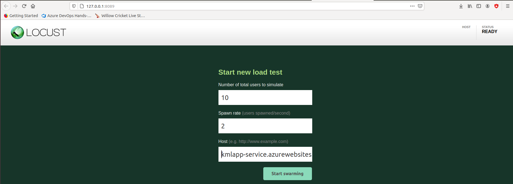

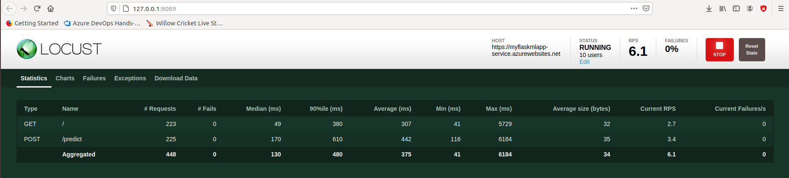

### Reference(s)

* Successful deploy of the project in Azure Pipelines.  [Note the official documentation should be referred to and double checked as you setup CI/CD](https://docs.microsoft.com/en-us/azure/devops/pipelines/ecosystems/python-webapp?view=azure-devops).

## Enhancements

* Run the app on Kubernetes cluster
* Use Azure Repos, Build and Release tasks in Azure DevOps to execute the CI/CD pipeline
* Automate the CI/CD using Infrastruture as Code (IaC)

## Demo 

Demo Video Link -> https://youtu.be/71IP_oNzAtQ

